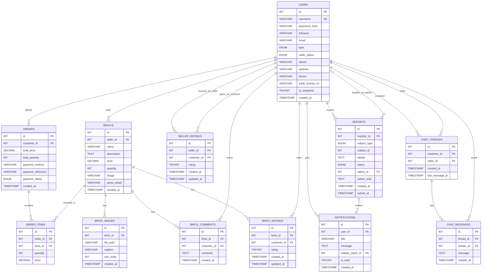

# BrickBD Database Structure

> VS Code tip: install a Mermaid preview extension (or use Markdown Preview if supported) to render this.

## Entity Relationship Diagram

## Database Overview

This database structure supports a comprehensive brick marketplace system with the following key features:

### Core Features

- **User Management:** Supports multiple user types including customers, sellers, and sub-admins
- **Product Catalog:** Bricks with multiple images, descriptions, and pricing
- **E-commerce:** Order processing with payment tracking and order items
- **Reviews & Ratings:** Customer feedback for both products (bricks) and sellers
- **Communication:** Real-time chat between customers and sellers
- **Moderation:** Reporting system with admin handling and notifications

## Table Descriptions

### USERS
Central user management table supporting different user types and seller verification.

**Key Fields:**
- `id` - Primary key
- `username` - Unique identifier for login
- `type` - User type (customer, seller, admin, etc.)
- `seller_status` - Seller verification status
- `trade_license_no` - For verified sellers
- `is_subadmin` - Sub-admin flag for delegated administration

### BRICKS
Product catalog table for brick listings.

**Key Fields:**
- `id` - Primary key
- `seller_id` - Foreign key to USERS table
- `name` - Product name
- `description` - Detailed product description
- `price` - Product price
- `quantity` - Available stock
- `image` - Primary product image
- `photo_detail` - Additional photo information

### BRICK_IMAGES
Supports multiple images per brick product.

**Key Fields:**
- `id` - Primary key
- `brick_id` - Foreign key to BRICKS table
- `file_path` - Image storage path
- `sort_order` - Display order for images

### ORDERS
Customer order records with payment tracking.

**Key Fields:**
- `id` - Primary key
- `customer_id` - Foreign key to USERS table
- `total_price` - Total order amount
- `payment_method` - Payment method used
- `payment_status` - Current payment status

### ORDER_ITEMS
Individual items within an order (line items).

**Key Fields:**
- `id` - Primary key
- `order_id` - Foreign key to ORDERS table
- `brick_id` - Foreign key to BRICKS table
- `quantity` - Quantity ordered
- `price` - Price at time of order

### BRICK_COMMENTS
Customer comments/reviews on brick products.

**Key Fields:**
- `id` - Primary key
- `brick_id` - Foreign key to BRICKS table
- `customer_id` - Foreign key to USERS table
- `comment` - Comment text

### BRICK_RATINGS
Numeric ratings for brick products.

**Key Fields:**
- `id` - Primary key
- `brick_id` - Foreign key to BRICKS table
- `customer_id` - Foreign key to USERS table
- `rating` - Numeric rating value
- `updated_at` - Allows rating updates

### SELLER_RATINGS
Numeric ratings for sellers.

**Key Fields:**
- `id` - Primary key
- `seller_id` - Foreign key to USERS table (seller being rated)
- `customer_id` - Foreign key to USERS table (customer rating)
- `rating` - Numeric rating value
- `updated_at` - Allows rating updates

### REPORTS
Content moderation and reporting system.

**Key Fields:**
- `id` - Primary key
- `reporter_id` - Foreign key to USERS table (user reporting)
- `subject_type` - Type of entity being reported
- `subject_id` - ID of the entity being reported
- `status` - Report status (pending, resolved, etc.)
- `admin_id` - Foreign key to USERS table (admin handling)
- `solved_at` - Resolution timestamp

### NOTIFICATIONS
User notification system.

**Key Fields:**
- `id` - Primary key
- `user_id` - Foreign key to USERS table
- `related_report_id` - Optional link to REPORTS table
- `is_read` - Read status flag

### CHAT_THREADS
Chat conversation threads between customers and sellers.

**Key Fields:**
- `id` - Primary key
- `customer_id` - Foreign key to USERS table
- `seller_id` - Foreign key to USERS table
- `last_message_at` - Timestamp of last message for sorting

### CHAT_MESSAGES
Individual messages within chat threads.

**Key Fields:**
- `id` - Primary key
- `thread_id` - Foreign key to CHAT_THREADS table
- `sender_id` - Foreign key to USERS table
- `message` - Message content

## Relationships Summary

### User Relationships
- Users can sell bricks (one-to-many)
- Users can place orders (one-to-many)
- Users can write comments (one-to-many)
- Users can rate bricks (one-to-many)
- Users can rate sellers (one-to-many)
- Users can create reports (one-to-many)
- Users can handle reports as admins (optional one-to-many)
- Users receive notifications (one-to-many)
- Users participate in chat threads as customers or sellers (one-to-many)
- Users send chat messages (one-to-many)

### Product Relationships
- Bricks have multiple images (one-to-many)
- Bricks have multiple comments (one-to-many)
- Bricks have multiple ratings (one-to-many)
- Bricks are included in order items (one-to-many)

### Order Relationships
- Orders contain multiple order items (one-to-many)

### Communication Relationships
- Chat threads have multiple messages (one-to-many)
- Reports can trigger notifications (optional one-to-many)

## Technical Notes

### Indexes Recommendations
For optimal performance, consider adding indexes on:
- Foreign key columns (seller_id, customer_id, brick_id, order_id, etc.)
- Frequently queried columns (username, email, status fields)
- Timestamp columns used for sorting (created_at, last_message_at)

### Data Types
- `PK` - Primary Key
- `FK` - Foreign Key
- `UK` - Unique Key
- `ENUM` - Enumerated type (predefined set of values)
- `TINYINT` - Small integer (0-255 or -128 to 127)
- `DECIMAL` - Fixed-point number for currency
- `TIMESTAMP` - Date and time value

### Security Considerations
- `password_hash` should use a strong hashing algorithm (bcrypt, Argon2, etc.)
- Sensitive user data (email, phone, address) should be encrypted at rest
- Payment information should follow PCI DSS guidelines
- Trade license information should be properly secured
